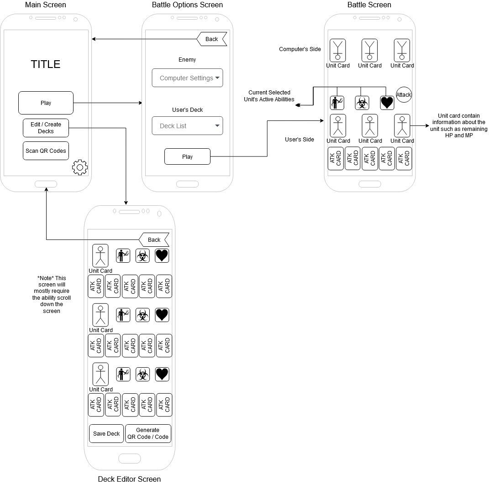

## Summary

_Project Card Combat_ is a turn based card game that pits the user against a Computer AI that can be played on your 
Android devices. _Project Card Combat_ lets the user create decks to beat the AI and allows the user to set conditions
for the AI for the purpose of challenging other users. The game opens to a menu allowing the user to choose whether they 
wish to make a deck, play against the computer with their created decks, attempt the challenge quests, set conditions 
for AI for the user created challenge quests, and export their created decks and challenge quests via a generated QR code.

## Intended users

* People who would like to pass some time with a quick simple game.

    > As someone who at times feels bored, I need an app that allows me to pass some time playing a game, so that 
	I'm not wasting my time doing absolutely nothing but instead keeping my brain active.

* People who enjoy solving puzzles and thinking challenges.

    >  As someone who enjoys solving a good puzzle, I would like an app that lets me play pre-made challenges 
	that come with the app and after beating those the ability to play and create user created challenges, so 
	that my friends and I can continue having fun with each other.

## Functionality

* Create custom-made decks.
	* The user chooses 3 units cards out of 7 and then chooses 5 attack cards for each unit for a total of a 15 card deck.
		* There 3 types of attack cards that can be chosen for a unit, red cards, blue cards, and green cards and one of each must be a chosen for a unit.
			* Red cards deal 1.5 times damage
			* Blue cards deal 1 times damage and build up the unit's magic gauge. 
			* Green cards deal 0.8 times damage and generate stars that increase the odds of a critical hit for other cards durning the next turn.
		* The unit cards have stats on them (i.e. _HP_, _ATK_, and _CRIT CHANCE_) and active abilities on them (i.e. _Heal_) 
			* The user may also choose certain active abilities for the units though this may be subject to change.
			* The units have a sort of Rock Paper Scissors style of effectiveness against each other.
		
* Play games against the computer with their created decks.
	* The game starts with the user's 3 unit cards being placed on the field.
	* At the start of the user's turn, the user then draws 5 cards from their deck and any crit stars are distributed to the attack cards.
	* The user then can choose to either activate the unit cards' active abilities or enter the attack phase.
	* In the attack phase the user chooses 3 cards of the 5 to attack the computer with and discards the other two.
		* (Note: Once the deck has been emptied, the played cards and the discarded cards are shuffled together and form another deck to draw from again.)
	* The computer's turn then comes and plays similarly to the user's.
	* The user's turn then comes and this repeats until either the user or the computer wins.
	* **Please note that gameplay of _Project Card Combat_ is currently subject to change depending on balance testing.**
	
* Play pre-made challenge quests or user created challenge quests.

* Set conditions for AI for the user created challenge quests.

* Create QR codes for custom-made decks or challenge quests.

* Scan QR codes to receive custom-made decks or challenge quests.

## Persistent data
* User created decks.

* User created AI Computer settings.

* Information about which challenges the user has completed.

* Settings.
	* Sound Settings
    
## Device/external services

### Device Services

* Audio.

* Camera.

### External services

* [Zxing](https://github.com/zxing/zxing)
	* A library that will generate QRCodes that will contain information that will create a deck.

* [QRCode Scanner](https://developers.google.com/ml-kit/vision/barcode-scanning/android)
	* A library that will allow the camera to read QRCodes.

## Stretch goals/possible enhancements 

* PvP over bluetooth.

* The ability to share decks with other users over bluetooth.

* The ability to share AI Computer settings with other users over bluetooth.

## Wireframe

